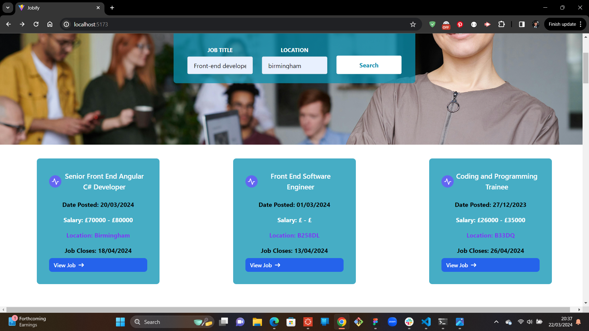

# Jobify-project

## Table of Contents
- [Jobify-project](#jobify-project)
  - [Table of Contents](#table-of-contents)
  - [Description](#description)
  - [Installations](#installations)
  - [Libraries](#libraries)
  - [Usage](#usage)
  - [Contribution](#contribution)
  - [Contributors](#contributors)
  - [Questions](#questions)
  - [Jobify-application](#jobify-application)
  - [License](#license)

## Description
A job board application for talent to find the job they deserve.
This application will take in information from users who are seeking prospective employers, about the roles they seek, location and desired pay.  This application enables job seekers to find the roles they seeking in the respective location.

## Installations
To use the website, clone your repo to your machine.
The first step is to install [Node.js](https://nodejs.org/en) onto your computer.
Install all dependencies by running the command "npm install" in the terminal.
Invoke the application by running the command "npm run dev" in the terminal.

## Libraries 
Tailwind Flowbite
Animate CSS

## Usage
This application will take in information from users who are seeking prospective employers, about the roles they seek, location and desired pay.  This application enables job seekers to find the roles they seeking in the respective location, salary sought using the user's input in the search bar. This website makes employment process smooth and easy for all seeking jobs.

## Contribution
If you wish to contribute to this application, you are welcome to do to so. Simply clone this repository, create your branch and submit a pull request. Please provide a clear title to enable me and others understand what you have contributed. Cheers.

## Contributors
Tayyaba ifzal (https://github.com/tayyabaifzal)
Victoria Adeyemi (https://github.com/victoriadeyemi)

## Questions
If you have questions about this repository or application, you can email me at <a href="mailto:victoriadeyemi1038@gmail.com">victoriadeyemi1038@gmail.com</a>  or visit my GitHub page at [victoriadeyemi](https://github.com/victoriadeyemi) // OR email Tayyaba at <a href="mailto:tayyaba.afzal@gmail.com">tayyaba.afzal@gmail.com</a>  or visit her GitHub page at [tayyabaifzal](https://github.com/tayyabaifzal)

## Jobify-application

[Here is a screen recording of the working application](https://drive.google.com/file/d/1UTvVZNBY7NRgn8hM-ySZb4niJl6WLlVq/view?usp=sharing)

## License

This application is licensed under the MIT License.
